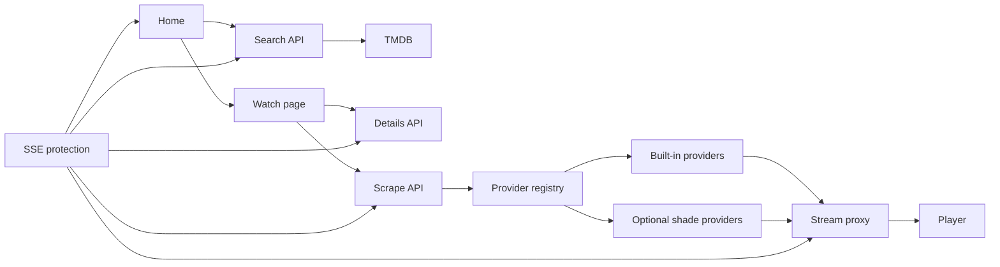

# Shiopa agent guide

Shiopa is an Astro and React streaming interface. Keep the UI quick, quiet, and consistent with the existing Shiopa visual language. Use pnpm for all package tasks.

## Project map

`src/pages` contains thin Astro routes.

`src/components/shiopa` contains the home, watch, player, and visual components.

`src/server/api` contains HTTP handlers. Shared server integrations live in `src/server`.

`src/lib/providers` contains built-in stream providers and the provider registry.

`src/shade` contains optional provider source and compiled provider modules.

`src/lib/nano` contains stream resolution, proxy headers, local library support, and compatibility code.

`src/protect/sse` contains the Shiopa Security Edge protection layer.

`docs` contains short developer documentation.

## Request flow



## Working rules

Keep page routes small and put request logic in `src/server/api`.

Add stable providers to `src/lib/providers` so production does not depend on generated local files. Register them in `registry.ts`.

Return non-2xx responses for failed stream resolution and a clear JSON error body.

Validate external URLs before proxying or playing them. Preserve provider origin and referer headers.

Avoid loading optional home features until they are enabled or visible.

Run `pnpm build` after changes to routes, providers, middleware, or Astro components.

## Lynx mobile app (`app/`)

Lynx is the iOS/Android app that clones the Shiopa nano UI. **All Lynx work lives in `poprink-nano/app`** — do not scatter mobile code into `src/` or a separate repo unless explicitly asked.

### What you're doing

Building a native-feeling Lynx client that mirrors Shiopa home, search, watch, and settings — plus a **local backend in the same `app/` folder** for catalog, scrape, and stream proxy during development. The long-term goal is a **custom mobile video player** (not a webview of the site player).

### Architecture

- **UI:** Lynx app under `app/` — Shiopa nano visual language, mobile navigation
- **Backend:** Local HTTP services colocated in `app/` (reuse nano provider/proxy ideas where practical; web routes in `src/pages/api` stay the web path)
- **Playback:** Custom player aimed at HLS/DASH, quality, subtitles — wired after UI shell exists
- **Docs in folder:** `app/README.md`, `app/ROADMAP.md`, `app/TODO.md`
- **Auth / i18n:** login optional and off by default (`features.enableAuth`); UI strings via `app/src/i18n` `useT` / `t`

### Roadmap (summary)

1. **Scaffold** — Lynx project + local backend + health/dev scripts  
2. **UI parity** — Shiopa nano screens without webview  
3. **Player** — custom controls and media pipeline  
4. **Streams** — resolve via local backend → proxy → play  
5. **Release builds** — signed iOS/Android, prod env, smoke checklist  

Prefer short, actionable changes in `app/`. Keep web Shiopa (`src/`) separate unless a shared provider fix is required for both clients.

### Run (Lynx app)

```bash
cd poprink-nano/app
pnpm install
pnpm --dir backend start          # local API on :8787 (proxies nano or mocks)
pnpm dev                          # Lynx Explorer QR
pnpm build                        # dist/shiopa.lynx.bundle
```

Set `NANO_ORIGIN` (default `http://127.0.0.1:4321`) so the backend can reach web Shiopa APIs, or `LYNX_MOCK=1` for offline mocks. App clients use `LYNX_API_BASE` (default `http://127.0.0.1:8787`).
