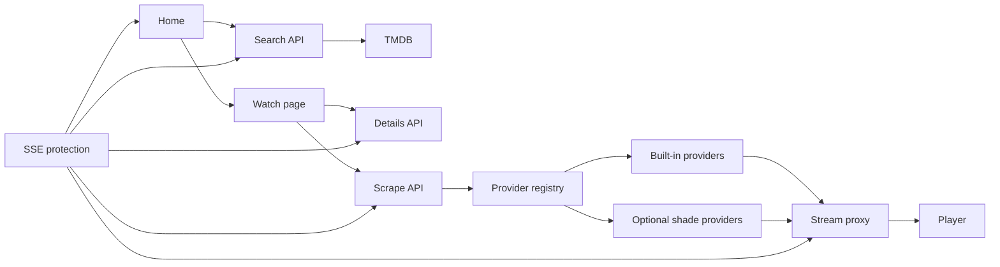

# Shiopa agent guide

Shiopa is an Astro and React streaming interface. Keep the UI quick, quiet, and consistent with the existing Shiopa visual language. Use pnpm for all package tasks.

## Project map

`src/pages` contains thin Astro routes.

`src/components/shiopa` contains the home, watch, player, and visual components.

`src/server/api` contains HTTP handlers. Shared server integrations live in `src/server`.

`src/lib/providers` contains built-in stream providers and the provider registry.

`src/shade` contains optional provider source and compiled provider modules.

`src/lib/nano` contains stream resolution, proxy headers, local library support, and compatibility code.

`src/protect/sse` contains the Shiopa Security Edge protection layer.

`docs` contains short developer documentation.

## Request flow

## Working rules

Keep page routes small and put request logic in `src/server/api`.

Add stable providers to `src/lib/providers` so production does not depend on generated local files. Register them in `registry.ts`.

Return non-2xx responses for failed stream resolution and a clear JSON error body.

Validate external URLs before proxying or playing them. Preserve provider origin and referer headers.

Avoid loading optional home features until they are enabled or visible.

Run `pnpm build` after changes to routes, providers, middleware, or Astro components.
